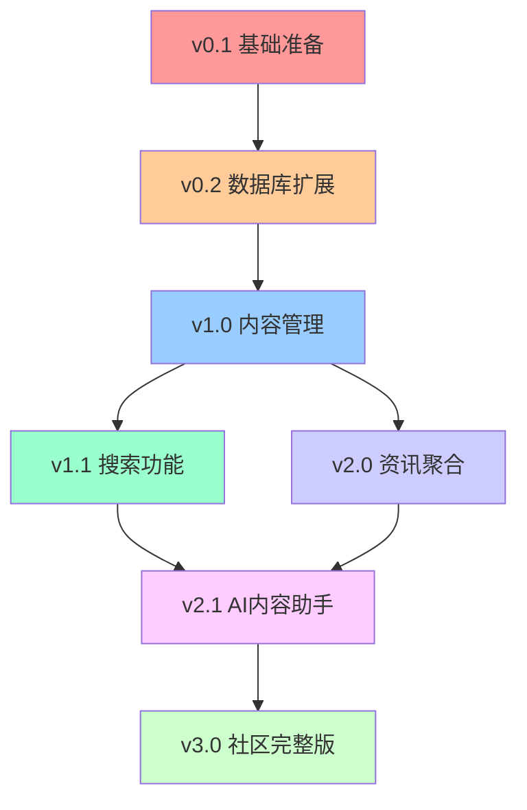

# Labubu梦想社区 - 详细开发计划

## 📋 项目概述

基于 `flux-kontext-template` 为主体，融合 `9d8dev/directory` 功能，创建Labubu主题垂直社区。

**项目周期**: 12周 (3个月)  
**开发模式**: 敏捷开发，每2周一个版本迭代  
**技术方案**: 渐进式融合，保持现有功能稳定性

---

## 🎯 版本规划总览

| 版本 | 名称 | 周期 | 核心功能 | 交付成果 |
|------|------|------|----------|----------|
| **v0.1** | 基础准备版 | 第1周 | 环境搭建 + 代码合并 | 可运行的融合框架 |
| **v0.2** | 数据库扩展版 | 第2周 | 数据库模式扩展 | 支持内容管理的数据结构 |
| **v1.0** | 内容管理版 | 第3-4周 | 基础内容管理功能 | 可发布收藏Labubu内容 |
| **v1.1** | 搜索功能版 | 第5-6周 | 智能搜索 + 分类 | 可搜索和筛选内容 |
| **v2.0** | 资讯聚合版 | 第7-8周 | 新闻聚合 + 全网热搜 | Labubu快报功能完整 |
| **v2.1** | AI内容助手版 | 第9-10周 | Claude集成 + 自动化 | AI驱动的内容生成 |
| **v3.0** | 社区完整版 | 第11-12周 | 主题优化 + 运营工具 | 完整Labubu社区平台 |

---

## 📅 详细版本计划

### 🚀 v0.1 基础准备版 (第1周)

**目标**: 搭建融合开发环境，确保现有功能正常运行

#### 我的任务 (AI助手)
```yaml
代码结构分析:
  - ✅ 分析9d8dev/directory项目结构
  - ✅ 识别可复用的核心组件
  - ✅ 制定代码合并策略
  - ✅ 创建项目融合脚本

环境配置:
  - ✅ 更新package.json依赖
  - ✅ 配置新的环境变量
  - ✅ 设置开发工具和脚本
  - ✅ 创建代码规范文档
```

#### 您需要提供的资源
```yaml
API密钥准备:
  - 🔑 Anthropic API Key (Claude内容生成)
  - 🔑 Exa Search API Key (语义搜索)
  - 🔑 Loops API Key (邮件服务，可选)

决策确认:
  - 📋 确认Labubu主题色彩方案
  - 📋 确认社区功能优先级
  - 📋 确认内容审核策略
```

#### 交付成果
- ✅ 可正常运行的融合项目框架
- ✅ 保持现有AI图像生成功能
- ✅ 新增基础页面结构 (资讯、秀场等空页面)
- ✅ 开发环境配置文档

---

### 🗄️ v0.2 数据库扩展版 (第2周)

**目标**: 扩展数据库支持内容管理功能

#### 我的任务 (AI助手)
```yaml
数据库设计:
  - ✅ 设计书签/内容表结构
  - ✅ 设计分类和标签系统
  - ✅ 设计用户收藏关系表
  - ✅ 创建数据库迁移脚本

API基础架构:
  - ✅ 创建内容管理API路由
  - ✅ 实现基础CRUD操作
  - ✅ 添加数据验证和错误处理
  - ✅ 设置API权限控制
```

#### 您需要提供的资源
```yaml
数据结构确认:
  - 📊 确认内容分类体系 (新品、资讯、教程等)
  - 📊 确认标签系统规则
  - 📊 确认用户权限等级

测试数据:
  - 📝 提供初始的Labubu内容数据
  - 📝 提供分类和标签示例
```

#### 交付成果
- ✅ 扩展的数据库结构 (兼容现有数据)
- ✅ 完整的内容管理API
- ✅ 数据库管理和迁移工具
- ✅ API接口文档

---

### 📚 v1.0 内容管理版 (第3-4周)

**目标**: 实现基础的内容发布和管理功能

#### 我的任务 (AI助手)
```yaml
前端组件开发:
  - ✅ 内容发布组件 (支持图片、链接、文字)
  - ✅ 内容展示组件 (卡片式布局)
  - ✅ 用户收藏功能组件
  - ✅ 基础分类筛选组件

页面开发:
  - ✅ Labubu秀场页面 (用户原创展示)
  - ✅ 个人收藏页面
  - ✅ 内容详情页面
  - ✅ 发布内容页面

功能集成:
  - ✅ 与现有用户系统集成
  - ✅ 与积分系统集成
  - ✅ 内容安全检查集成
```

#### 您需要提供的资源
```yaml
内容策略:
  - 📋 确认内容发布规则
  - 📋 确认积分奖励机制
  - 📋 提供内容示例和模板

UI设计反馈:
  - 🎨 确认页面布局和交互设计
  - 🎨 确认Labubu主题元素应用
```

#### 交付成果
- ✅ 用户可发布Labubu相关内容
- ✅ 完整的内容展示和收藏功能
- ✅ 基础的分类和筛选功能
- ✅ 与现有积分系统整合

---

### 🔍 v1.1 搜索功能版 (第5-6周)

**目标**: 集成智能搜索和高级筛选功能

#### 我的任务 (AI助手)
```yaml
搜索系统开发:
  - ✅ 集成Exa语义搜索API
  - ✅ 实现全文搜索功能
  - ✅ 开发高级筛选器
  - ✅ 实现搜索结果排序

前端搜索界面:
  - ✅ 搜索输入和建议组件
  - ✅ 筛选面板组件
  - ✅ 搜索结果展示组件
  - ✅ 搜索历史和收藏搜索

性能优化:
  - ✅ 搜索结果缓存
  - ✅ 分页和懒加载
  - ✅ 搜索性能监控
```

#### 您需要提供的资源
```yaml
搜索策略:
  - 📊 确认搜索权重和排序规则
  - 📊 确认热门搜索关键词
  - 📊 提供搜索测试用例

用户反馈:
  - 👥 搜索功能用户测试
  - 👥 搜索体验优化建议
```

#### 交付成果
- ✅ 强大的语义搜索功能
- ✅ 多维度内容筛选
- ✅ 个性化搜索推荐
- ✅ 搜索分析和监控

---

### 📰 v2.0 资讯聚合版 (第7-8周)

**目标**: 实现Labubu快报和全网热搜功能

#### 我的任务 (AI助手)
```yaml
资讯聚合系统:
  - ✅ 开发网络爬虫和API聚合
  - ✅ 实现内容去重和筛选
  - ✅ 开发资讯分类和标签
  - ✅ 实现自动更新机制

社交媒体集成:
  - ✅ 微博、小红书内容聚合
  - ✅ Instagram、Twitter集成
  - ✅ 热度排行算法
  - ✅ 实时更新推送

前端展示系统:
  - ✅ 资讯瀑布流组件  
  - ✅ 热搜排行榜组件
  - ✅ 资讯详情页面
  - ✅ 订阅和通知功能
```

#### 您需要提供的资源
```yaml
内容源配置:
  - 🔗 提供关注的社交媒体账号列表
  - 🔗 确认新闻源和RSS订阅
  - 🔗 设置关键词和话题标签

内容审核:
  - 📋 制定内容筛选规则
  - 📋 设置敏感词过滤
  - 📋 确认内容发布审核流程
```

#### 交付成果
- ✅ 自动化的Labubu资讯聚合
- ✅ 全网热搜实时更新
- ✅ 个性化资讯推荐
- ✅ 资讯订阅和通知系统

---

### 🤖 v2.1 AI内容助手版 (第9-10周)

**目标**: 集成Claude AI实现智能内容生成和分析

#### 我的任务 (AI助手)
```yaml
AI服务集成:
  - ✅ 集成Anthropic Claude API
  - ✅ 开发内容自动生成功能
  - ✅ 实现智能摘要和标签
  - ✅ 开发内容质量评估

智能功能开发:
  - ✅ 自动生成Labubu描述
  - ✅ 智能分类和标签建议  
  - ✅ 内容趋势分析
  - ✅ 个性化内容推荐

AI工具界面:
  - ✅ AI内容生成器组件
  - ✅ 智能编辑助手
  - ✅ 内容优化建议面板
  - ✅ AI分析报告页面
```

#### 您需要提供的资源
```yaml
AI训练数据:
  - 📚 提供Labubu相关知识库
  - 📚 提供优质内容样本
  - 📚 确认AI生成内容的风格指导

功能优先级:
  - 🎯 确认最需要的AI功能
  - 🎯 设置AI使用权限和限制
  - 🎯 确认AI内容审核标准
```

#### 交付成果
- ✅ 智能的内容生成助手
- ✅ 自动化的内容分析和标签
- ✅ AI驱动的个性化推荐
- ✅ 内容质量智能评估

---

### 🎨 v3.0 社区完整版 (第11-12周)

**目标**: 完善Labubu主题设计和运营工具

#### 我的任务 (AI助手)
```yaml
主题优化:
  - ✅ 完整的Labubu主题UI设计
  - ✅ 自定义Labubu吉祥物动画
  - ✅ 主题色彩和字体优化
  - ✅ 移动端响应式优化

运营工具开发:
  - ✅ 管理员数据分析面板
  - ✅ 用户行为分析工具
  - ✅ 内容运营管理系统
  - ✅ 自动化运营脚本

商业化功能:
  - ✅ 高级会员功能扩展
  - ✅ 广告位管理系统
  - ✅ 付费内容功能
  - ✅ 数据导出和报告
```

#### 您需要提供的资源
```yaml
设计资源:
  - 🎨 Labubu官方素材和图片
  - 🎨 品牌色彩和设计规范
  - 🎨 动画和交互效果需求

运营策略:
  - 📊 确认关键业务指标
  - 📊 设置用户等级和特权
  - 📊 制定内容激励机制

上线准备:
  - 🚀 域名和服务器配置
  - 🚀 SEO优化需求
  - 🚀 上线发布计划
```

#### 交付成果
- ✅ 完整的Labubu主题社区平台
- ✅ 强大的运营管理工具
- ✅ 完善的商业化功能
- ✅ 可规模化的技术架构

---

## 🔗 依赖关系图



## 📋 任务分工明细

### 🤖 我负责的技术任务 (AI助手)

**核心开发工作:**
- ✅ 所有代码编写和调试
- ✅ 数据库设计和迁移
- ✅ API开发和集成
- ✅ 前端组件开发
- ✅ 第三方服务集成
- ✅ 性能优化和错误处理
- ✅ 代码审查和重构
- ✅ 技术文档编写

**AI和自动化:**
- ✅ AI服务集成 (Flux + Claude + Exa)
- ✅ 内容聚合脚本开发
- ✅ 数据分析和报告
- ✅ 自动化测试脚本

### 👤 您负责的决策和资源 (产品负责人)

**产品决策:**
- 📋 功能需求确认和优先级
- 📋 用户体验和界面设计确认
- 📋 业务规则和运营策略制定
- 📋 内容审核和管理规范

**资源提供:**
- 🔑 API密钥和服务账号
- 🎨 设计素材和品牌资源
- 📚 内容数据和知识库
- 🧪 用户测试和反馈收集

**项目管理:**
- 📅 版本发布时间确认
- 🎯 里程碑验收和确认
- 💰 预算和资源分配
- 🚀 上线发布和推广

---

## ⚠️ 风险预警和应对

### 🔴 高风险项目

| 风险项目 | 风险等级 | 应对策略 | 责任方 |
|---------|---------|---------|--------|
| **API密钥限制** | 🔴 高 | 提前申请，备用方案 | 您 |
| **数据迁移失败** | 🟡 中 | 分步迁移，备份策略 | 我 |
| **第三方服务不稳定** | 🟡 中 | 多服务商，降级方案 | 我 |
| **性能瓶颈** | 🟡 中 | 提前优化，监控预警 | 我 |

### 🟢 成功关键因素

1. **及时沟通** - 每周同步进展，及时解决问题
2. **版本控制** - 严格按版本交付，确保每版本可运行
3. **测试验证** - 每个功能开发完成后立即测试验证
4. **文档更新** - 保持技术文档和使用说明同步更新

---

## 📊 项目监控指标

### 开发进度指标
- 📈 **代码完成度**: 每周统计代码提交量
- 🧪 **功能测试通过率**: 每版本功能测试结果
- 🐛 **Bug修复率**: 发现问题的解决速度
- 📚 **文档完整度**: 技术文档和用户手册

### 产品质量指标  
- ⚡ **页面加载速度**: < 3秒
- 📱 **移动端兼容性**: 支持主流移动设备
- 🔒 **安全性测试**: 通过基础安全检测
- 🌐 **浏览器兼容**: 支持Chrome、Safari、Firefox

---

## 🎯 交付标准

### 每个版本必须满足:
- ✅ **功能完整**: 承诺的功能100%实现
- ✅ **稳定运行**: 在3000端口正常运行
- ✅ **代码质量**: 通过ESLint和TypeScript检查
- ✅ **文档齐全**: 更新README和使用说明
- ✅ **Git记录**: 提交到master分支并写好注释

### 最终交付成果:
- 🌟 **完整的Labubu主题社区平台**
- 📱 **响应式Web应用 + 移动端适配**
- 🤖 **AI图像生成 + 智能内容管理**
- 💰 **完整的商业化功能**
- 📊 **运营管理和数据分析工具**
- 📚 **完整的技术文档和用户手册**

---

**准备开始了吗？请确认以下几点后我们就可以启动开发：**

1. ✅ 您已阅读并同意本开发计划
2. 🔑 您准备好提供必要的API密钥  
3. 🎨 您准备好Labubu设计素材
4. 📅 您确认3个月的开发周期
5. 💬 您同意每周定期沟通进展

**确认后回复"开始开发"，我立即启动v0.1版本的开发工作！** 🚀 